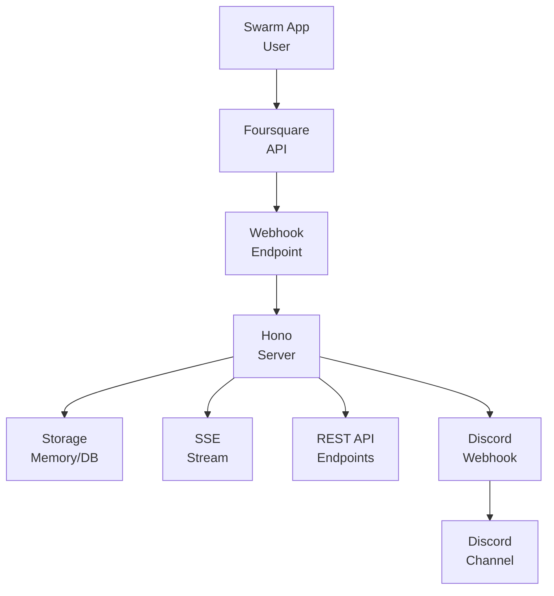

# CLAUDE.md - Swarm API リアルタイム統合プロジェクト

## プロジェクト概要

Foursquare Swarm のチェックインをリアルタイムで取得し、処理するWebアプリケーション。TypeScript と Hono フレームワークを使用して実装。

## 技術スタック

- **言語**: TypeScript
- **フレームワーク**: Hono (軽量Webフレームワーク)
- **ランタイム**: Node.js
- **API**: Foursquare API v2 (User Push API)
- **認証**: OAuth 2.0

## 主要機能

### 1. リアルタイムチェックイン受信
- Foursquare User Push API を使用したWebhook実装
- チェックインが発生した瞬間にプッシュ通知を受信
- 非同期処理によるパフォーマンス最適化

### 2. OAuth2認証
- Foursquareアカウントでのログイン機能
- アクセストークンの取得と管理
- ユーザー情報の取得

### 3. データ処理と保存
- チェックインデータの検証と正規化
- 場所情報、スコア、コメントの処理
- メモリストア（開発用）とデータベース連携対応

### 4. Discord通知連携
- Discord Webhook を使用した自動通知
- チェックイン情報をリアルタイムでDiscordチャンネルに送信
- カスタマイズ可能なメッセージフォーマット

### 5. RESTful API
- チェックイン履歴の取得
- ユーザー別・場所別の統計情報
- Server-Sent Events (SSE) によるリアルタイムストリーミング

## アーキテクチャ



## セキュリティ要件

### HTTPS必須
- Webhookエンドポイントは443ポートでHTTPS接続が必要
- 自己署名証明書も使用可能（開発環境）

### IP制限
- Foursquareからのリクエスト: `199.38.176.0/22` をホワイトリスト登録

### 認証と検証
- OAuth 2.0によるユーザー認証
- Push Secretによる署名検証
- アクセストークンの安全な管理

## 開発環境セットアップ

### 1. 環境変数の設定

```bash
# .env ファイル
FOURSQUARE_CLIENT_ID=your_client_id_here
FOURSQUARE_CLIENT_SECRET=your_client_secret_here
FOURSQUARE_REDIRECT_URI=https://your-domain.com/auth/callback
WEBHOOK_URL=https://your-domain.com/webhook/checkin
FOURSQUARE_PUSH_SECRET=your_push_secret_here
DISCORD_WEBHOOK_URL=https://discord.com/api/webhooks/your_webhook_id/your_webhook_token
PORT=3000
```

### 2. 依存関係のインストール

```bash
pnpm install
```

### 3. 開発用トンネリング（Cloudflare Tunnel推奨）

```bash
# Cloudflare Tunnelのインストール
brew install cloudflare/cloudflare/cloudflared  # Mac
# または
wget -q https://github.com/cloudflare/cloudflared/releases/latest/download/cloudflared-linux-amd64.deb
sudo dpkg -i cloudflared-linux-amd64.deb  # Ubuntu/Debian

# トンネルの起動
cloudflared tunnel --url http://localhost:3000
```

### 4. 開発サーバーの起動

```bash
# 開発モード（ホットリロード付き）
pnpm run dev

# モックサーバー（テスト用）
pnpm run mock

# 全部まとめて起動
pnpm run dev:all
```

## ファイル構成

```
project/
├── src/
│   ├── index.ts           # メインアプリケーション
│   ├── auth.ts            # OAuth2認証処理
│   ├── webhook.ts         # Webhookエンドポイント
│   ├── discord.ts         # Discord通知処理
│   ├── store.ts           # データストア
│   └── mock-webhook-sender.ts  # 開発用モックサーバー
├── .env                   # 環境変数
├── package.json           # 依存関係とスクリプト
├── tsconfig.json          # TypeScript設定
├── docker-compose.yml     # Docker構成（オプション）
├── Dockerfile            # Dockerイメージ定義
└── nginx.conf            # Nginx設定（本番用）
```

## API エンドポイント

### 認証
- `GET /auth/foursquare` - OAuth認証開始
- `GET /auth/callback` - OAuth コールバック

### Webhook
- `POST /webhook/checkin` - チェックイン受信
- `POST /webhook/venue` - 会場イベント受信（オプション）
- `GET /webhook/health` - ヘルスチェック

### REST API
- `GET /api/checkins` - 最近のチェックイン一覧
- `GET /api/checkins/user/:userId` - ユーザー別チェックイン
- `GET /api/checkins/stream` - SSEストリーム
- `GET /api/stats` - 統計情報

## Webhookペイロード形式

```typescript
type WebhookPayload = {
  readonly user: {
    readonly id: string
    readonly firstName: string
    readonly lastName?: string
  }
  readonly checkin: string  // JSON文字列
  readonly secret: string   // 検証用シークレット
}

type Checkin = {
  readonly id: string
  readonly createdAt: number
  readonly type: "checkin"
  readonly shout?: string
  readonly user: User
  readonly venue?: Venue
  readonly score?: Score
}

type DiscordWebhookPayload = {
  readonly content?: string
  readonly embeds?: readonly DiscordEmbed[]
  readonly username?: string
  readonly avatar_url?: string
}

type DiscordEmbed = {
  readonly title?: string
  readonly description?: string
  readonly color?: number
  readonly timestamp?: string
  readonly footer?: {
    readonly text: string
    readonly icon_url?: string
  }
  readonly author?: {
    readonly name: string
    readonly icon_url?: string
  }
  readonly fields?: readonly {
    readonly name: string
    readonly value: string
    readonly inline?: boolean
  }[]
}
```

## 開発のヒント

### モックサーバーの活用
開発初期はモックサーバーを使用してWebhookの受信処理をテスト。実際のFoursquare APIを使わずに開発可能。

### RequestBinでペイロード確認
[Webhook.site](https://webhook.site) や [RequestBin](https://requestbin.com) を使用して、実際のWebhookペイロードを確認。

### エラーハンドリング
- Webhookは常に200 OKを返す（Foursquareの要件）
- エラーログは非同期で記録
- タイムアウトを避けるため重い処理は非同期実行

## トラブルシューティング

### Webhookが受信できない
1. HTTPS設定を確認
2. IPホワイトリスト設定を確認
3. Push Secret が正しいか確認
4. Developer ConsoleでWebhook URLが正しく設定されているか確認

### 認証エラー
1. Client ID/Secret が正しいか確認
2. Redirect URI が Developer Console の設定と一致しているか確認
3. API Version (v=YYYYMMDD) が最新か確認

### パフォーマンス問題
1. Webhook処理を非同期化
2. データベース接続のプーリング
3. キャッシュの実装検討

## 本番デプロイ

### Google Cloud 推奨構成

#### Cloud Functions (推奨 - コスト最適)
- **料金**: 200万リクエスト/月まで無料
- **Cold start**: あり（Foursquareのリトライで対応）
- **最適用途**: 低頻度チェックイン（月数回程度）

```bash
# デプロイコマンド
gcloud functions deploy swarm-webhook \
  --gen2 \
  --runtime=nodejs20 \
  --source=. \
  --entry-point=app \
  --trigger=http \
  --region=us-central1 \
  --allow-unauthenticated
```

#### Cloud Run (高頻度用)
- **料金**: 最小インスタンス1台で約$19/月
- **Cold start**: なし（最小インスタンス設定時）
- **最適用途**: 高頻度チェックイン

```bash
# デプロイコマンド
gcloud run deploy swarm-webhook \
  --source=. \
  --region=us-central1 \
  --min-instances=1 \
  --memory=512Mi \
  --cpu=0.5 \
  --allow-unauthenticated
```

### デプロイ手順
1. Google Cloud CLI の設定
2. 本番用環境変数の設定（Cloud ConsoleのSecret Manager推奨）
3. TypeScriptのビルド (`pnpm run build`)
4. 上記コマンドでデプロイ
5. Foursquare Developer ConsoleでWebhook URL更新

### コスト比較
- **Cloud Functions**: ほぼ無料（低頻度利用時）
- **Cloud Run最小インスタンス**: 約$19/月（us-central1）
- **検証方法**: まずCloud Functionsで試行、失敗率が高い場合はCloud Runに移行

## 参考リンク

- [Foursquare Developer Console](https://foursquare.com/developers/apps)
- [Foursquare API Documentation](https://docs.foursquare.com/developer/reference/real-time-view)
- [Hono Documentation](https://hono.dev/)
- [Cloudflare Tunnel](https://developers.cloudflare.com/cloudflare-one/connections/connect-apps/)

## ライセンスとクレジット

このプロジェクトはFoursquare API利用規約に従って実装されています。
プライバシーポリシーに従い、ユーザーデータを適切に管理してください。