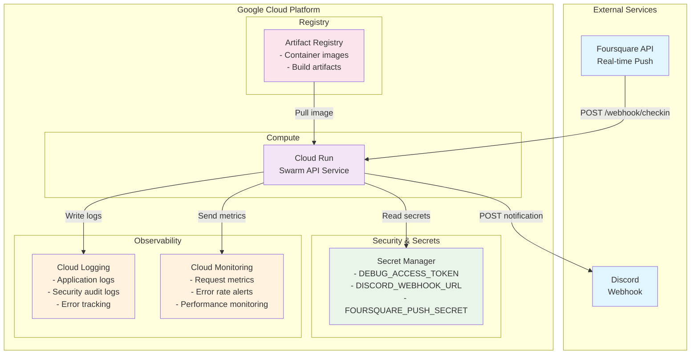
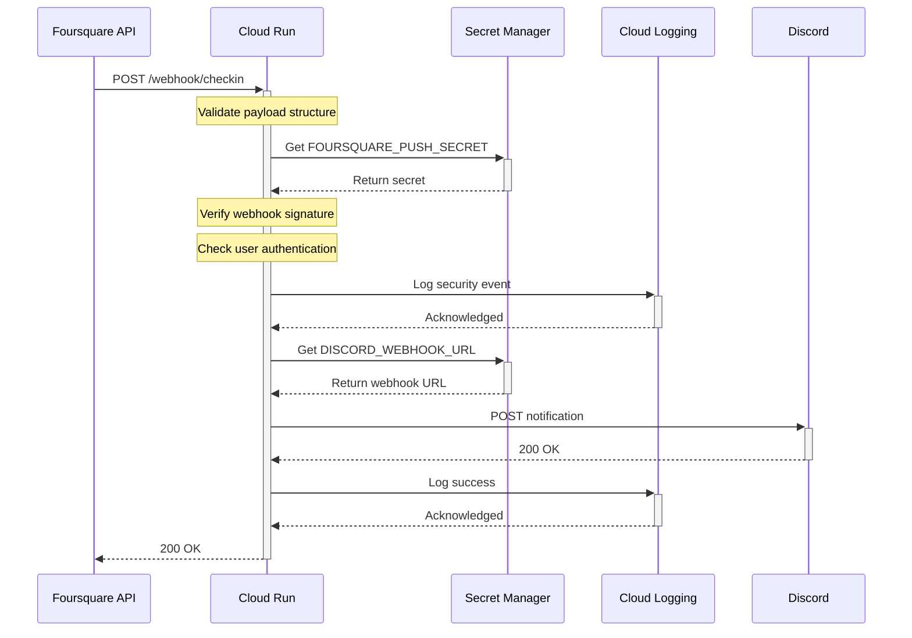
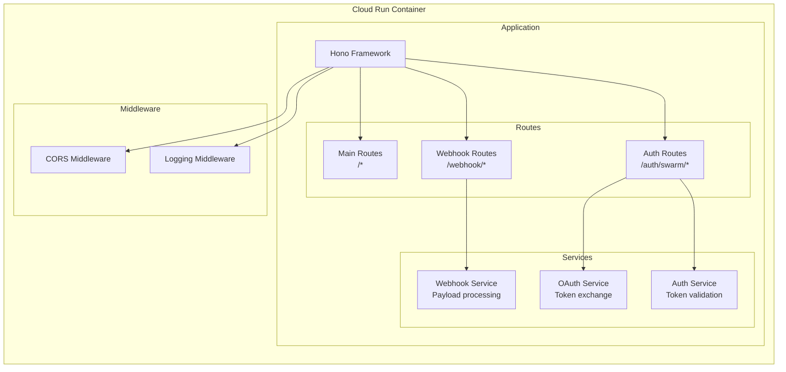
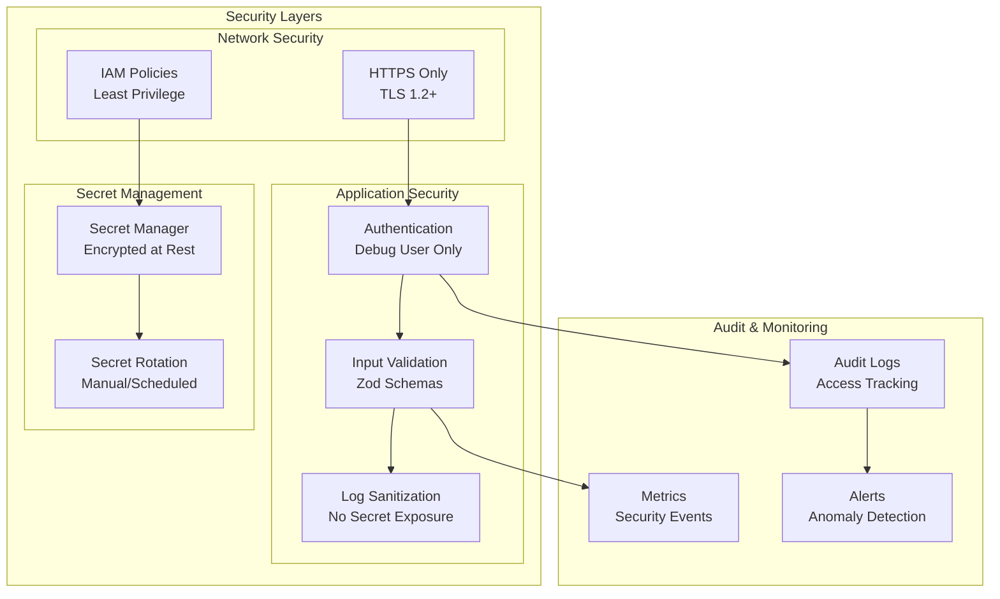
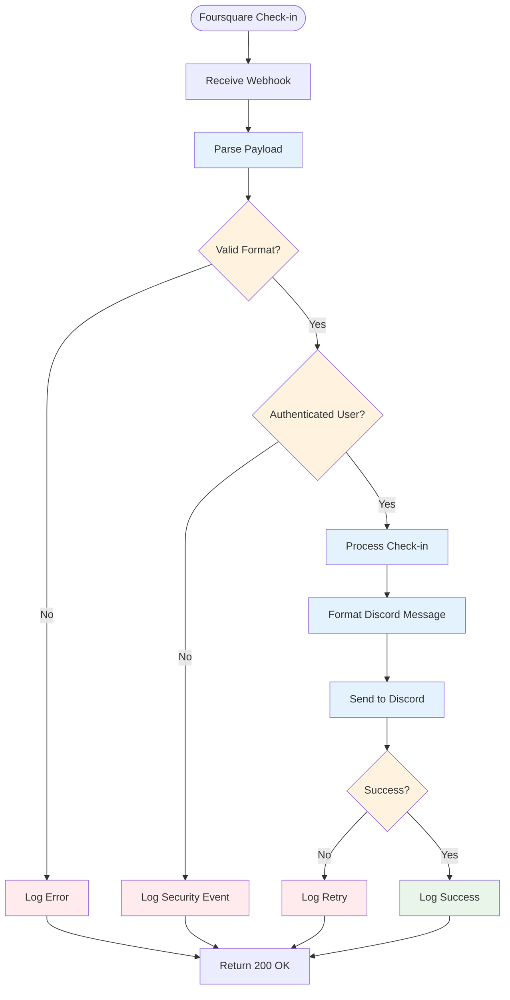
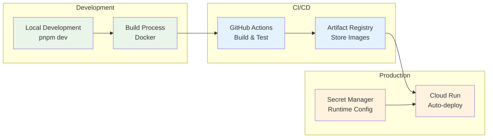
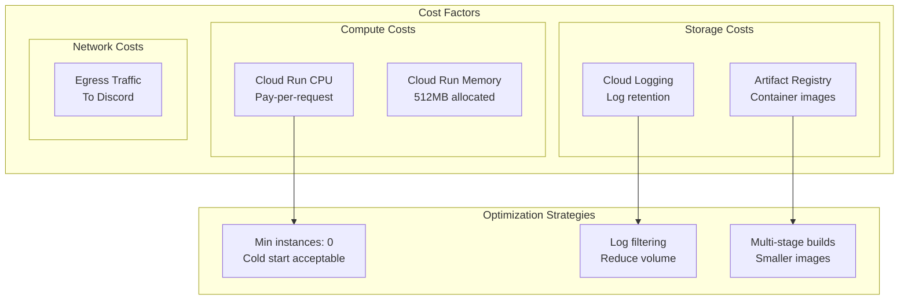
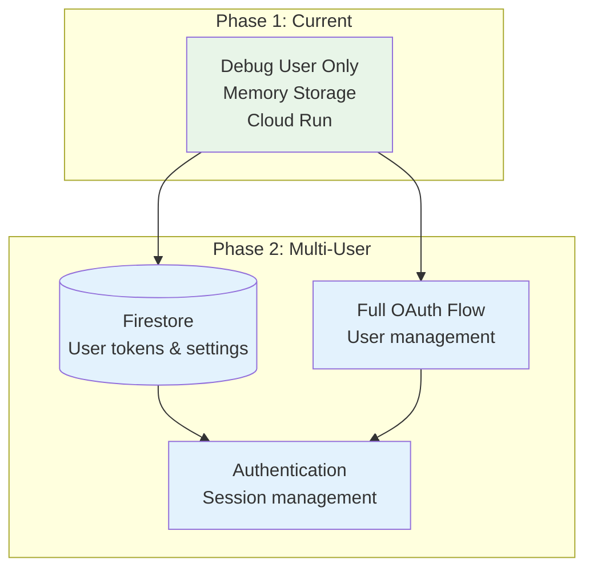
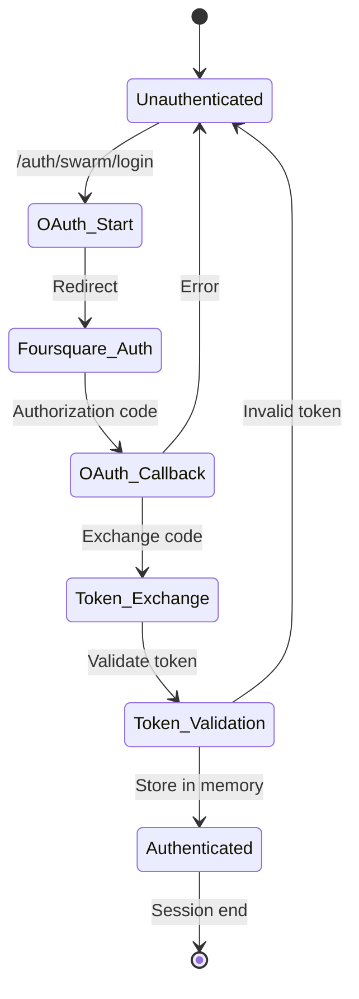
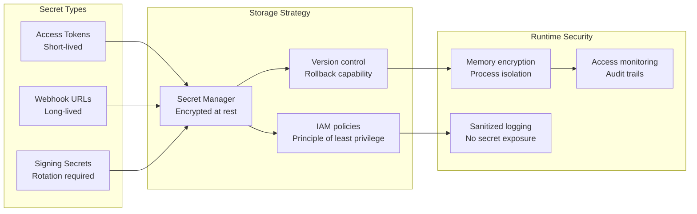

# Infrastructure Architecture

## Overview

This document describes the Google Cloud Platform infrastructure architecture for the Swarm API Real-time Integration project. The design prioritizes simplicity, security, and cost-effectiveness for the initial debug-user implementation.

## High-Level Architecture

## Request Flow

## Component Details

### Cloud Run Service

**Configuration:**
- **CPU**: 1 vCPU (auto-scaling)
- **Memory**: 512MB
- **Min instances**: 0 (cost optimization)
- **Max instances**: 10
- **Timeout**: 60 seconds
- **Port**: 8080

### Security Architecture

### Data Flow

## Deployment Architecture

## Cost Optimization

## Future Extensions

## Security Considerations

### Authentication Flow

### Secret Management Strategy

## Resource Requirements

### Initial Deployment (Debug Phase)

| Resource | Configuration | Monthly Cost (Estimate) |
|----------|---------------|------------------------|
| Cloud Run | 1 vCPU, 512MB, ~100 requests/day | $0.50 |
| Secret Manager | 3 secrets, ~1000 accesses/month | $0.06 |
| Cloud Logging | ~1GB logs/month | $0.50 |
| Artifact Registry | ~500MB images | $0.05 |
| Cloud Monitoring | Basic metrics | Free tier |
| **Total** | | **~$1.11/month** |

### Phase 2 Scale (Multi-user with Firestore)

| Resource | Configuration | Monthly Cost (Estimate) |
|----------|---------------|------------------------|
| Cloud Run | 2 vCPU, 1GB, auto-scale | $30 |
| Firestore | 100GB storage, 1M operations | $20 |
| Secret Manager | 10 secrets, 100k accesses | $6 |
| Cloud Logging | 5GB logs | $2.50 |
| Artifact Registry | 1GB images | $0.10 |
| Cloud Monitoring | Standard metrics | $2 |
| **Total** | | **~$60/month** |

## Implementation Checklist

- [ ] Create Google Cloud project
- [ ] Enable required APIs (Cloud Run, Secret Manager, etc.)
- [ ] Set up IAM roles and service accounts
- [ ] Configure Secret Manager with production secrets
- [ ] Create Dockerfile for containerization
- [ ] Set up Cloud Build for CI/CD
- [ ] Configure Cloud Run service
- [ ] Set up monitoring and alerting
- [ ] Test end-to-end deployment
- [ ] Document operational procedures